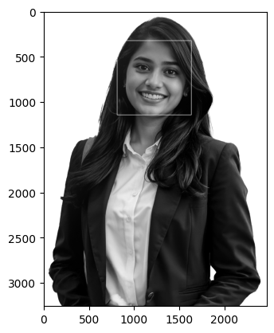
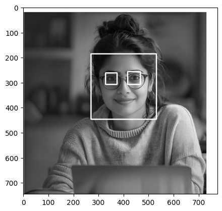
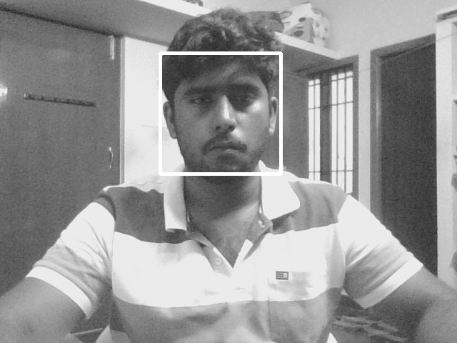

# Face Detection using Haar Cascades with OpenCV and Matplotlib

## Aim

To write a Python program using OpenCV to perform the following image manipulations:  
i) Extract ROI from an image.  
ii) Perform face detection using Haar Cascades in static images.  
iii) Perform eye detection in images.  
iv) Perform face detection with label in real-time video from webcam.

## Software Required

- Anaconda - Python 3.7 or above  
- OpenCV library (`opencv-python`)  
- Matplotlib library (`matplotlib`)  
- Jupyter Notebook or any Python IDE (e.g., VS Code, PyCharm)

## Algorithm

### I) Load and Display Images

- Step 1: Import necessary packages: `numpy`, `cv2`, `matplotlib.pyplot`  
- Step 2: Load grayscale images using `cv2.imread()` with flag `0`  
- Step 3: Display images using `plt.imshow()` with `cmap='gray'`

### II) Load Haar Cascade Classifiers

- Step 1: Load face and eye cascade XML files 
### III) Perform Face Detection in Images

- Step 1: Define a function `detect_face()` that copies the input image  
- Step 2: Use `face_cascade.detectMultiScale()` to detect faces  
- Step 3: Draw white rectangles around detected faces with thickness 10  
- Step 4: Return the processed image with rectangles  

### IV) Perform Eye Detection in Images

- Step 1: Define a function `detect_eyes()` that copies the input image  
- Step 2: Use `eye_cascade.detectMultiScale()` to detect eyes  
- Step 3: Draw white rectangles around detected eyes with thickness 10  
- Step 4: Return the processed image with rectangles  

### V) Display Detection Results on Images

- Step 1: Call `detect_face()` or `detect_eyes()` on loaded images  
- Step 2: Use `plt.imshow()` with `cmap='gray'` to display images with detected regions highlighted  

### VI) Perform Face Detection on Real-Time Webcam Video

- Step 1: Capture video from webcam using `cv2.VideoCapture(0)`  
- Step 2: Loop to continuously read frames from webcam  
- Step 3: Apply `detect_face()` function on each frame  
- Step 4: Display the video frame with rectangles around detected faces  
- Step 5: Exit loop and close windows when ESC key (key code 27) is pressed  
- Step 6: Release video capture and destroy all OpenCV windows  


## Program:
#### Developed by: Ashqar Ahamed S T
#### Register No: 212224240018

```py
import numpy as np
import cv2 
import matplotlib.pyplot as plt
from IPython.display import clear_output
```

```py

with_glass = cv2.imread('image_02.png')
with_out_glass = cv2.imread('image_01.png')
group_photo = cv2.imread('image_03.png')

with_glass = cv2.cvtColor(with_glass, cv2.COLOR_BGR2GRAY)
with_out_glass = cv2.cvtColor(with_out_glass, cv2.COLOR_BGR2GRAY)
group_photo = cv2.cvtColor(group_photo, cv2.COLOR_BGR2GRAY)
```

```py
face_cascade = cv2.CascadeClassifier('haarcascade_frontalface_default.xml')

def detect_face(img):
    faces = face_cascade.detectMultiScale(img, scaleFactor=1.1, minNeighbors=5)

    for (x, y, w, h) in faces:
        cv2.rectangle(
            img,
            (x, y),
            (x+w, y+h),
            (255,255,255),
            3
        )

    
    return img

result = detect_face(with_glass)
```

```py
def adj_detect_face(img):

    faces = face_cascade.detectMultiScale(
        img,
        scaleFactor=1.05,
        minNeighbors=3,
        minSize=(30,30)
    )

    for (x, y, w, h) in faces:

        cv2.rectangle(
            img,
            (x,y),
            (x+w,y+h),
            (0,255,0),
            2
        )
    
        
    return img
    
```

```py
eye_cascade = cv2.CascadeClassifier('haarcascade_eye.xml')
def detect_eyes(img):
    eyes = eye_cascade.detectMultiScale(img, scaleFactor=1.1, minNeighbors=5)
    for (x, y, w, h) in eyes:
        cv2.rectangle(
            img,
            (x, y),
            (x+w, y+h),
            (255,255,255),
            3
        )
  
        
    return img
    
```
```py
cap = cv2.VideoCapture(0)

while True:
    ret, frame = cap.read()

    if not ret:
        break

    gray = cv2.cvtColor(frame, cv2.COLOR_BGR2GRAY)

    gray = detect_face(gray)

    cv2.imshow('Video Face Detection', gray)

    if cv2.waitKey(1) & 0xFF == 27:
        break

cap.release()
cv2.destroyAllWindows()
```

## Output:

Face Detection:



Eye Detection:



Real Time Face Detection from Webcam




## Result:
Thus, a Python program using OpenCV to Perform the following:
i) To detect face using Haar Cascades in static images 
ii) To detect eye in images 
iii) To detect face with label in real-time video from webcam.
was executed successfully.